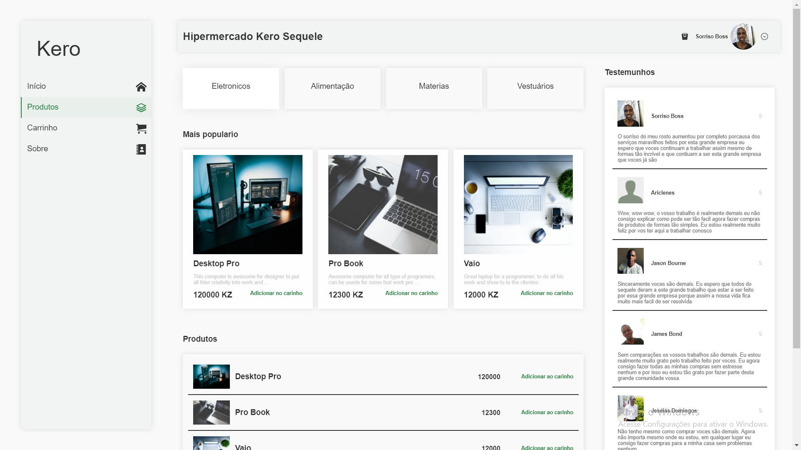

# E-commerce Applicaiton 🛒🛒🛒

🚧<b>This aplication is still under development</b>🚧

 

# 🔤 App Info

**This application is just a piece 🍰 of a collection of other apps, which work together, to build one big powerfull e-commerce APP 🎂.**

> ## App division 
> 1. **Clients** webapp to browse and order products
> 2. **Administrators** webapp to get all client orders
> 3. **RESTfull API** to connect both **webapps**  

**I am planning on building 🧱 a mobile app so clients can order on their smarphones 📱 aswell. I'll be using ReactNative.**

 

# Clients Webpage ℹ️

**This piece 🍕 of the application is the one which clients will have access to.**

> ## Features 😎
>- WebApp **List** all products, sold by the shop 🛒  
>- Clients can **Order** products, after creating user account 🤗 
>- Adding **Reviews** for the public to see 👀 
>- Getting in **Touch** by sending messages 🍂

You can visit this webapp <a target="_blank" href="https://kerosequele.netlify.app/#products">here</a>.

<b>❗ This webapp depends on a server to provide all it's data. So if the server is not yet online, the webapp will be very empty ❗</b>  

<b>❗ And this webapp is still under development so please dont mind the if somethings just dont look right ❗</b>

> ## Built With ⚒ ?
> **I went a little bit old fashion while building this app, but used some pretty new and cool web technologies.**
> 1. **Pug** (HTML)
> 2. **SASS** (CSS)
> 3. **Typescript** (Javascript)  
> 
Using a framework like <b>ReactJS</b> would be totally perfect for this kind of app. I plan on swicthing it someday to <b>ReactJS</b>. 
